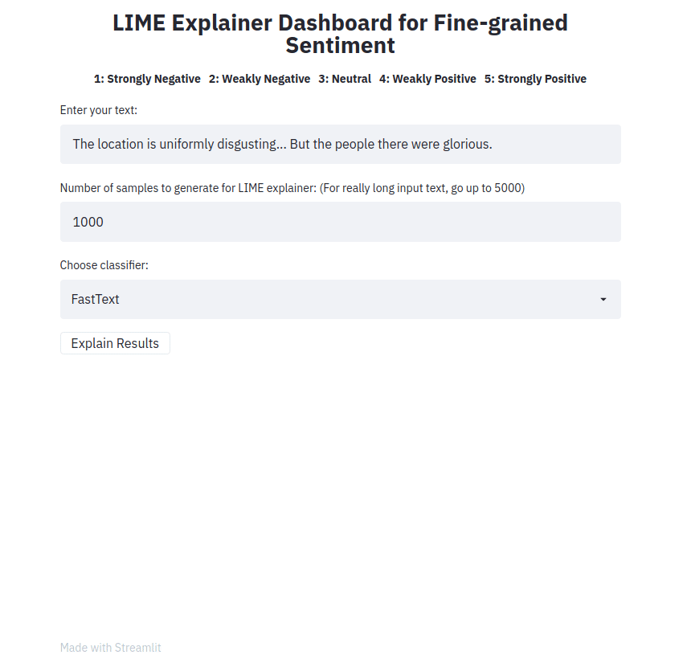

# Project for the  2024S2024S-T3 AISC2013 - Deployment of AI Solutions 02
# Fine Grained Sentiment Classification Explainer App

This repository hosts a Streamlit-based interactive application for explaining fine-grained sentiment classification results. The app provides insights into various classifiers trained on the Stanford Sentiment Treebank (SST-5) dataset, where sentiment labels range from 1 (very negative) to 5 (very positive).

## Features

- Implements multiple classifiers with explanations using the LIME explainer.
- Easily deployable on local environments using Streamlit.
- Provides a straightforward interface to understand sentiment predictions.

## Why Streamlit?

Streamlit is chosen for its lightweight and minimalist framework, ideal for quickly prototyping UI designs with minimal code. It simplifies the deployment of web applications by abstracting away complex backend configurations.

## Installation

1. Set up a virtual environment and install dependencies:
   ```bash
   python3 -m venv venv
   source venv/bin/activate
   pip3 install -r requirements.txt
2. Activate the virtual environment for further development:
    ```bash
    source venv/bin/activate

## Usage

After the virtual environment is set up and activated, run the app using the command below:

  ```bash
  streamlit run app.py
```
- Enter a sentence, choose a type of classifier, and click on the button "Explain results".
- We can then observe the features (i.e., words or tokens) that contributed to the classifier predicting a particular class label.
## Demo for the front-end
* The front-end app takes in a text sample and outputs LIME explanations for the different methods. The app is is deployed using Heroku
* Play with your own text examples as shown below and see the fine-grained sentiment results explained!



https://github.com/user-attachments/assets/d317af5e-4a77-499b-bbb5-74d0556ffacb

